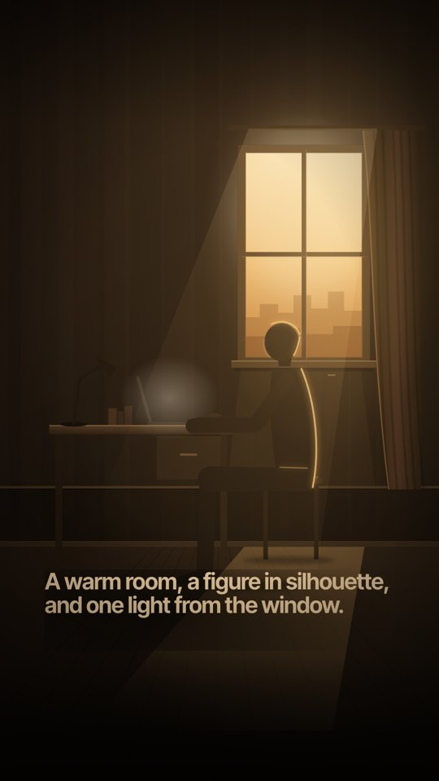
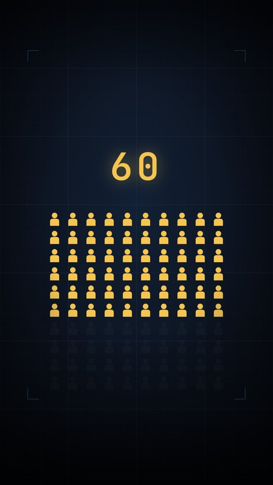
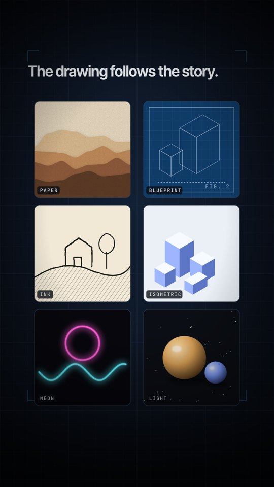

# voiceover-motion-graphics

**An AI-agent skill for making premium, voiceover-synced motion-graphics videos — in HTML.**

Give an agent (Claude, or any coding model) a script and a voiceover. It designs and builds the video
as a set of HTML "beat" pages — hand-built SVG illustration, kinetic typography, data animation, a
real camera rig — where **every animation lands on the word that's being spoken**. Then it validates
the pages, reviews screenshots of its own work, and renders a frame-exact 1080×1920 MP4 with your audio.

Made for vertical shorts (TikTok / Reels / YouTube Shorts) and narrated explainers.

<p align="center">
  
  
  
</p>

> **Demo video:** _coming soon — rendered with a human-sounding voiceover._

## What makes the output look professional

- **The voice is the clock.** A speech aligner (faster-whisper) gives every word a timestamp; every
  reveal, count-up, highlight and cut is tied to a word. Re-record the voice and the whole video re-times itself.
- **Real illustration, not clip-art.** One key light, gradients, rim light, contact shadows, depth
  planes and a slow camera push. A style kit covers very different looks: paper cut-out, blueprint,
  hand-drawn ink, isometric, neon, lit 3D forms, documentary data.
- **A motion grammar.** Purpose-specific easing curves, durations, reading-time rules and a catalogue
  of ~100 keyframes, so motion is varied and deliberate instead of "fade everything".
- **Guardrails for agents.** A validator catches silent bugs (animations that never play, plates
  covering the stage, broken timelines), a documented list of failure modes explains each one, and a
  mandatory screenshot review loop makes the agent look at its frames before it calls anything done.

## Install

**Claude app (claude.ai / desktop):** download `voiceover-motion-graphics.skill` from the
[latest release](../../releases/latest) and open it — it installs as a skill.

**Claude Code:**
```bash
git clone https://github.com/thegreatLUCY/voiceover-motion-graphics ~/.claude/skills/voiceover-motion-graphics
```

**Any other agent:** clone the repo and tell the agent to read `SKILL.md` and follow it.

### Requirements
- Python 3 (+ `pip install pillow` for contact sheets, `pip install faster-whisper` for real voiceovers)
- Node 18+ and Playwright with Chromium — inside your project folder: `npm i playwright && npx playwright install chromium`
- ffmpeg
- Internet access while rendering (Google Fonts, and GSAP from jsDelivr for camera shots)

## Quick start (by hand)

```bash
bash scripts/init_project.sh ./my-video     # engine + scripts + example project
cd my-video && npm i playwright && npx playwright install chromium
python3 estimate_timings.py script.txt timings.json    # timings before you have audio
python3 build.py && node check.mjs                     # build the pages, validate (must PASS)
node review.mjs review 1                               # screenshots + contact sheets — look at them
open p1-s01.html                                       # space = play, G = safe zones, arrows = scrub

# record the voiceover (one paragraph = one shot), save as VO/part1.mp3, then:
python3 vosync.py VO/part1.mp3 script.txt timings.json
python3 build.py && node check.mjs
node render.mjs 1 30 video.mp4 VO/part1.mp3            # 1080x1920 H.264 + AAC
```

With an agent, just ask: *"Make a motion-graphics video for this script"* — the skill tells it the rest.

## What's inside

| Path | Contents |
|---|---|
| `SKILL.md` | the workflow the agent follows |
| `engine/` | `shared.css` (tokens, keyframes, cards) · `shared.js` (clock, kinetic type, word sync, builders) · `motion.js` (GSAP camera rig) · `defs.js` (example scenes + style kit) |
| `scripts/` | project init, timing estimate, voiceover aligner, build helpers, validator, review, render, audio split |
| `example/` | a 6-shot demo that uses every technique |
| `references/` | art direction & drawing guide, design system, motion grammar, illustration recipes, engine API, failure modes, voiceover format, review checklist |

## Credits and licences

MIT licensed (see `LICENSE`). Pages load [GSAP](https://gsap.com) from a CDN under GSAP's own licence
(free for most uses — check it for yours) and fonts from Google Fonts (Inter Tight, JetBrains Mono,
Instrument Serif — SIL Open Font License). Nothing third-party is bundled in this repo.

The engine grew out of producing a narrated documentary series; contributions — new styles, artwork,
fixes — are welcome.
