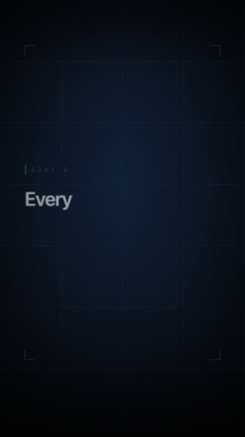
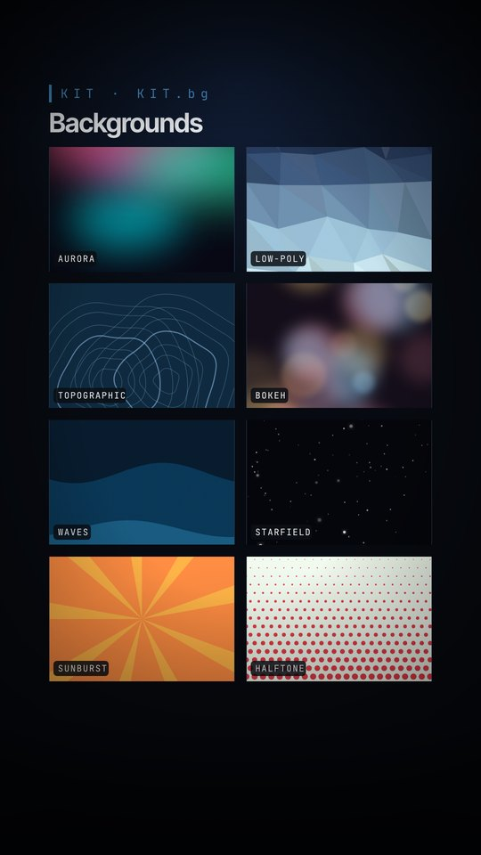
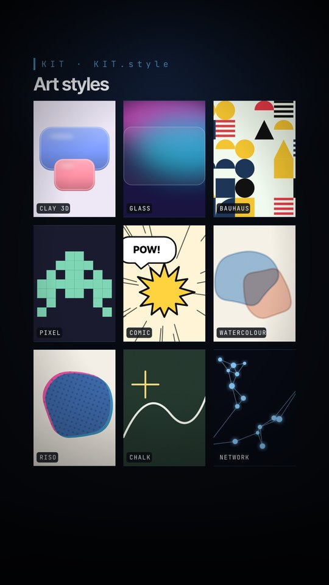
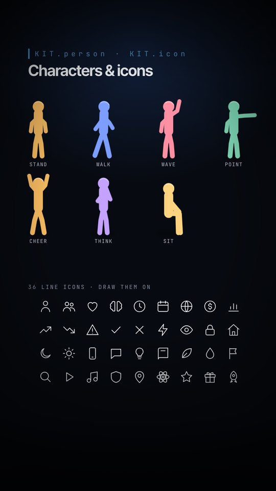
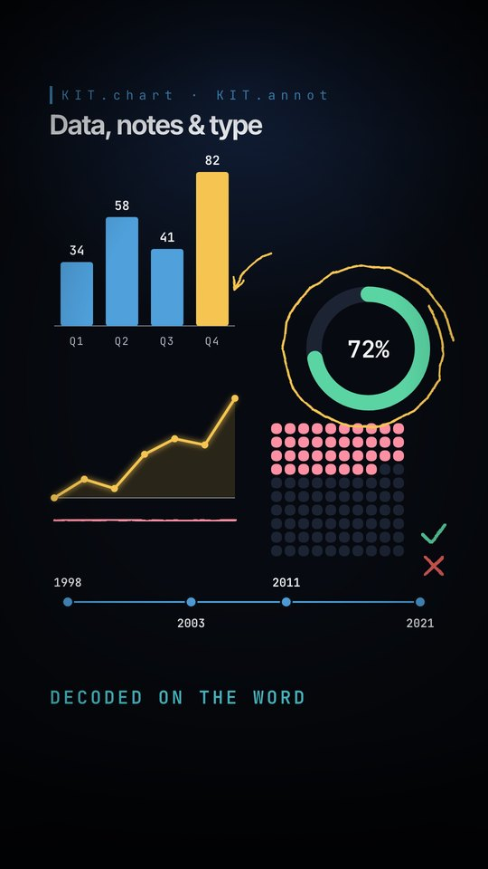
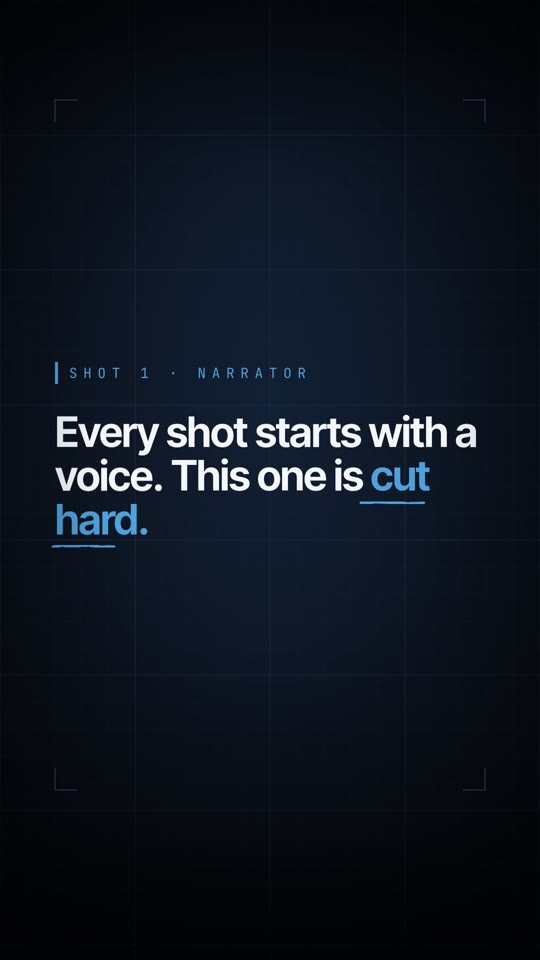
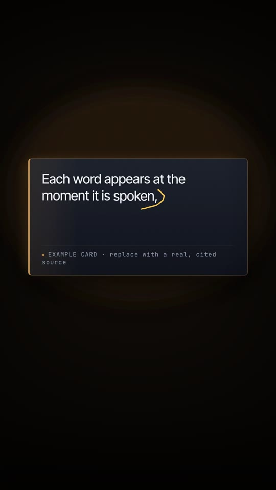
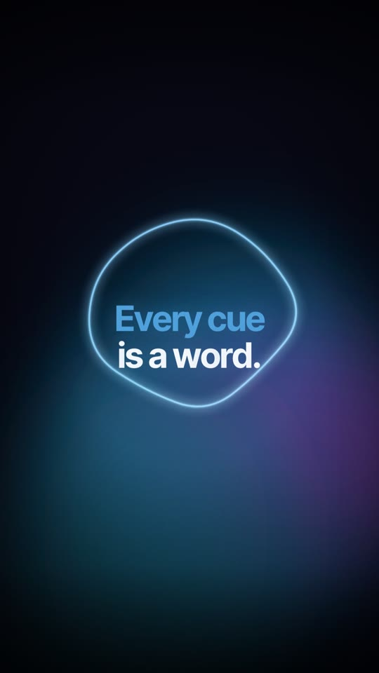
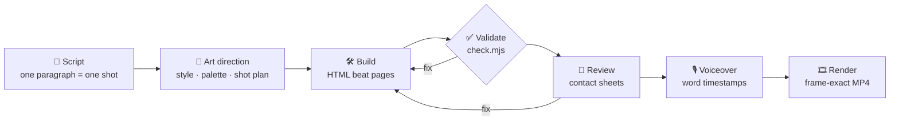

<div align="center">

# 🎬 voiceover-motion-graphics

### Turn a script and a voiceover into a studio-quality motion-graphics video — made by an AI agent, in HTML.

[](LICENSE)
[](../../releases/latest)


<a href="docs/demo.mp4"></a>

**▶ [Watch the demo with sound](docs/demo.mp4)** · 47 seconds · every animation lands on a spoken word

</div>

---

## ✨ What it does

You give an agent a **script** and a **voiceover**. It designs the video, draws the artwork, animates
it so **every reveal lands on the word being spoken**, checks its own work, and renders a
frame-exact MP4 with your audio.

<table>
<tr>
<td width="33%" valign="top">

### 🎙️ The voice is the clock
A speech aligner timestamps every word. Every reveal, count-up, highlight and cut is tied to a
word — re-record the voice and the whole film re-times itself.

</td>
<td width="33%" valign="top">

### 🎨 Draws anything, in any style
20+ art directions — lit vector, paper, blueprint, ink, isometric, neon, clay, glass, bauhaus, pixel,
comic, watercolour, chalk, low-poly — plus characters, icons, charts and hand-drawn notes.

</td>
<td width="33%" valign="top">

### 🔍 Checks its own work
A validator catches silent bugs, and a review loop makes the agent **look at screenshots of its
frames** before calling anything done.

</td>
</tr>
</table>

---

## 🧰 The kit

Everything below is drawn in code, so it can be recoloured, combined and animated on any word.

<table>
<tr>
<td align="center" width="25%"><br><b>🌌 Backgrounds</b><br><sub>aurora · low-poly · topographic · bokeh · waves · starfield · sunburst · halftone · dot &amp; iso grids</sub></td>
<td align="center" width="25%"><br><b>🖌️ Art styles</b><br><sub>clay 3D · glass · bauhaus · pixel · comic · watercolour · riso · chalk · network</sub></td>
<td align="center" width="25%"><br><b>🧍 Characters &amp; icons</b><br><sub>7 posable characters · 36 line icons that draw themselves on</sub></td>
<td align="center" width="25%"><br><b>📊 Data &amp; notes</b><br><sub>bars · lines · donuts · waffles · timelines · hand-drawn circles, arrows, ticks</sub></td>
</tr>
</table>

### 🎞️ Motion toolbox

| | Move | What it's for |
|---|---|---|
| ✍️ | **Draw-on** | lines, icons and diagrams draw themselves as they're named |
| 🫧 | **Morph** | one shape becomes another — ideas transforming |
| 🔢 | **Counters** | numbers land exactly on the spoken number |
| ⌨️ | **Typewriter & decode** | text types or "decrypts" into place |
| ⭕ | **Annotate** | circle, underline or arrow to any word as it's said |
| 🛤️ | **Follow a path** | a dot travels a route, a plane flies a map |
| 🎥 | **Camera rig** | real depth planes, parallax and slow pushes (GSAP) |
| 🌀 | **Transitions** | iris, wipes, zoom-through, rack focus, glitch |
| ♾️ | **Procedural** | orbits, swarms, live graphs — any motion you can write as a function of time |
| 🎨 | **Palettes** | 7 one-line looks: documentary, warm story, pastel, neon night, paper, blueprint, print |

---

## 🎬 From the demo

<p align="center">
  
  
  
  
  
  
</p>
<p align="center"><sub>narrator card · lit scene with a camera rig · word-synced quote · data on the word · six styles · morphing end card</sub></p>

---

## 🔄 How it works



| Step | What happens |
|---|---|
| 1️⃣ **Script** | Paragraphs are shaped around what the viewer should *see*. |
| 2️⃣ **Art direction** | The agent picks a style and palette for *this* story and plans every shot: the words, the one idea, the visual metaphor, which word triggers what. |
| 3️⃣ **Build** | Each shot is an HTML page: layered SVG artwork + choreography where every time is a word (`W(n, "sixty")`). |
| 4️⃣ **Validate** | Catches animations that never play, plates covering the stage, fades that snap back, overruns, gaps. |
| 5️⃣ **Review** | Screenshots at 30/60/95 % of every shot, scored against a checklist — at least two passes. |
| 6️⃣ **Voiceover** | Drop in your recording; faster-whisper aligns every word and the film re-times itself. |
| 7️⃣ **Render** | Playwright seeks every frame exactly and ffmpeg muxes your audio: 1080×1920 H.264 + AAC. |

---

## 🚀 Install

**🟣 Claude app (claude.ai / desktop)** — download `voiceover-motion-graphics.skill` from the
[latest release](../../releases/latest) and open it.

**⌨️ Claude Code**
```bash
git clone https://github.com/thegreatLUCY/voiceover-motion-graphics ~/.claude/skills/voiceover-motion-graphics
```

**🤖 Any other agent** — clone the repo and tell the agent to read `SKILL.md` and follow it.

Then just ask: ***"Make a motion-graphics video for this script."***

<details>
<summary><b>📦 Requirements</b></summary>

- Python 3 (+ `pip install pillow` for contact sheets, `pip install faster-whisper` for real voiceovers)
- Node 18+ and Playwright with Chromium — in your project folder: `npm i playwright && npx playwright install chromium`
- ffmpeg
- Internet while rendering (Google Fonts, and GSAP from jsDelivr for camera shots)

</details>

<details>
<summary><b>🧑‍💻 Quick start by hand</b></summary>

```bash
bash scripts/init_project.sh ./my-video     # engine + scripts + example + kit gallery
cd my-video && npm i playwright && npx playwright install chromium
python3 gallery.py                                     # build the KIT cookbook — open gallery-1..4.html
python3 estimate_timings.py script.txt timings.json    # timings before you have audio
python3 build.py && node check.mjs                     # build the pages, validate (must PASS)
node review.mjs review 1                               # screenshots + contact sheets — look at them
open p1-s01.html                                       # space = play, G = safe zones, arrows = scrub

# record the voiceover (one paragraph = one shot), save as VO/part1.mp3, then:
python3 vosync.py VO/part1.mp3 script.txt timings.json
python3 build.py && node check.mjs
node render.mjs 1 30 video.mp4 VO/part1.mp3            # 1080x1920 H.264 + AAC
```

</details>

<details>
<summary><b>🎙️ Tips for the voiceover</b></summary>

- One paragraph of script = one shot. Leave a blank line between paragraphs.
- Spell numbers out ("sixty", not "60") so the aligner can find them.
- A natural, human read (ElevenLabs, or your own voice) makes the biggest difference to the final feel.
- After `vosync.py`, read the printed transcript next to each paragraph — it shows any line that was dropped.

</details>

---

## 🗂️ What's inside

| | Path | Contents |
|---|---|---|
| 📘 | `SKILL.md` | the workflow the agent follows |
| ⚙️ | `engine/` | `shared.js` one clock + motion helpers · `kit.js` the creative toolkit · `defs.js` scenes & style primitives · `motion.js` GSAP camera · `shared.css` ~125 keyframes · `palettes.css` |
| 🛠️ | `scripts/` | init, timing estimate, voiceover aligner, validator, review, render, audio split |
| 🎬 | `example/` | the 6-shot demo above + `gallery.py`, the kit cookbook |
| 📚 | `references/` | drawing anything, design system, motion grammar, illustration, engine API, failure modes, voiceover, review checklist |

---

## 💛 Credits & licence

MIT licensed — use it, remix it, ship videos with it. Pages load [GSAP](https://gsap.com) from a CDN
under GSAP's own licence and fonts from Google Fonts (Inter Tight, JetBrains Mono, Instrument Serif —
SIL Open Font License). Nothing third-party is bundled.

Built while producing a narrated documentary series. **Contributions are welcome** — new styles,
characters, transitions, palettes, fixes. If you make something with it, open an issue and share it! 🎉
